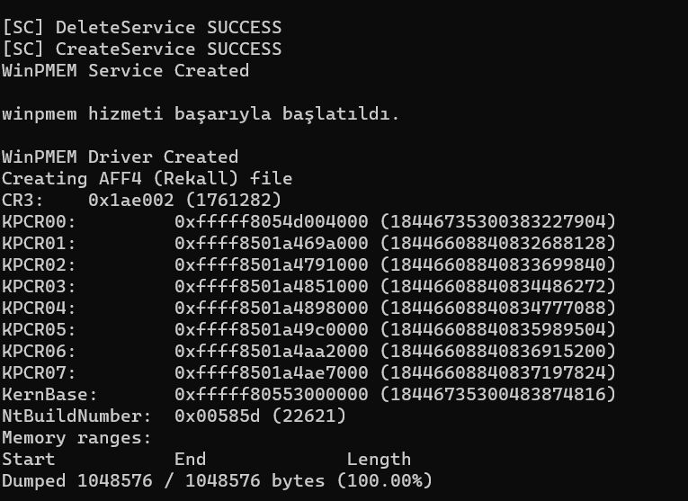

# PyMem - Windows Memory Acquisition Tool

A Python-based Windows memory acquisition tool that creates Volatility-compatible raw memory dumps. Uses the WinPMEM driver to safely read physical memory with multiple scanning strategies for optimal performance across different system configurations.

## Key Features

- **Volatility Compatible**: Creates raw memory dumps that work directly with Volatility 2/3
- **Multiple WinPMEM Modes**: Auto-tests PTE, Physical, and I/O Space modes for maximum compatibility
- **Smart Memory Scanning**: 6 different scan strategies with adaptive chunk sizing based on RAM size
- **MMIO Region Skipping**: Automatically skips known problematic memory regions (PCI, graphics MMIO)
- **Large Memory Support**: Handles systems with 32GB+ RAM efficiently with RAM-adaptive chunk sizing
- **Progress Tracking**: Real-time progress bars with visual indicators and detailed logging
- **CLI Interface**: Command-line options for scan strategy, filename, and memory size control
- **Safety Features**: Memory safety testing, error handling, and consecutive error limits
- **Metadata Generation**: Creates JSON metadata and Volatility command reference files

## How It Works

PyMem automatically detects your system's RAM size and uses adaptive chunk sizing based on total memory. The tool:

1. **Driver Management**: Creates and manages the WinPMEM kernel driver service
2. **Mode Testing**: Tests multiple WinPMEM modes (PTE, Physical, I/O Space) for compatibility
3. **Memory Discovery**: Uses driver memory runs or falls back to intelligent scanning
4. **Smart Scanning**: 6 different strategies with adaptive chunk sizes (≤8GB: 0.5x, 8-32GB: 1x, ≥32GB: 2x)
5. **MMIO Avoidance**: Skips known problematic regions (PCI config space, graphics MMIO)
6. **Physical Layout**: Creates raw dumps with physical memory offsets preserved for Volatility
7. **Metadata Generation**: Produces JSON metadata and analysis command references

## Compatible Analysis Tools

- **Volatility 2**: `python vol.py -f memory_dump.raw imageinfo`
- **Volatility 3**: `vol -f memory_dump.raw windows.info`
- **AccessData FTK Imager**: Raw memory analysis
- **Rekall**: Memory forensics framework

## Tested Operating Systems

- Windows 11 Build Number 22621.2283 (Virtual Machine)

## Screenshots




## Installation & Setup

### Prerequisites

1. **Enable Test Signing** (Administrator required):
   ```cmd
   bcdedit /set testsigning on
   ```

2. **Check Memory Compression**:
   ```powershell
   Get-MMAgent
   ```

3. **Disable Memory Compression** (recommended for better performance):
   ```powershell
   Disable-MMAgent -mc
   ```

4. **Restart your computer**

### Installation

```bash
# Install Python dependencies
winget install python
python -m pip install -r requirements.txt

# Or install from PyPI
pip install pymem_snapshot
```

## Usage Examples

### Basic Usage

```bash
# Auto-detect RAM, use smart scan (default)
python example.py

# Custom filename
python example.py --filename my_memory_dump

# Limit memory size (4GB example)
python example.py --memsize 4294967296 --filename limited_dump
```

### Scan Strategies

```bash
# Fast scan for large systems (16GB+)
python example.py --scan fast --filename fast_dump

# Ultra-fast scan for very large systems (32GB+)
python example.py --scan ultrafast --filename ultra_dump

# Comprehensive scan for thorough analysis
python example.py --scan comprehensive --filename deep_analysis

# Aggressive scan for problematic systems
python example.py --scan aggressive --filename aggressive_dump
```

### Available Scan Strategies

| Strategy | Chunk Size | Use Case | Speed | Coverage | Best For |
|----------|------------|----------|-------|----------|----------|
| `smart` | 32MB (adaptive) | Default choice, skips MMIO | Fast | High | Most systems |
| `comprehensive` | 16MB (adaptive) | Thorough analysis | Slow | Highest | Critical analysis |
| `aggressive` | 8MB (adaptive) | Problematic systems | Medium | Very High | Troubleshooting |
| `fast` | 64MB (adaptive) | Large systems | Very Fast | Good | 16GB+ RAM |
| `ultrafast` | 128MB (adaptive) | Very large systems | Fastest | Good | 32GB+ RAM |
| `auto` | Dynamic | Tries smart first, falls back | Variable | High | Default choice |

**Note**: All strategies use adaptive chunk sizing based on total RAM size (≤8GB: 0.5x, 8-32GB: 1x, ≥32GB: 2x)

## Output Files

- **`filename.raw`**: Raw memory dump (Volatility-compatible)
- **`filename_metadata.json`**: Memory runs and system information
- **`filename_volatility_info.txt`**: Volatility commands and analysis guide

## Technical Details

### WinPMEM Modes
- **PTE Mode**: Page Table Entry mode (default, most compatible)
- **Physical Mode**: Direct physical memory access
- **I/O Space Mode**: I/O space memory mapping
- **Auto-Testing**: Tool tests all modes and uses the first successful one

### Adaptive Chunk Sizing
- **≤8GB RAM**: 0.5x base chunk size (more conservative)
- **8-32GB RAM**: 1x base chunk size (balanced)
- **≥32GB RAM**: 2x base chunk size (optimized for large systems)

### Memory Region Handling
- **Driver Runs**: Uses WinPMEM driver's memory run information when available
- **Smart Scanning**: Skips known MMIO regions (PCI config, graphics memory)
- **Adaptive Jumping**: Increases jump size after consecutive failures
- **Error Limits**: Stops after 5-100 consecutive errors (strategy-dependent)

### Performance Notes
- **32GB+ Systems**: Use `--scan ultrafast` for best performance
- **Memory Compression**: Disable with `Disable-MMAgent -mc` for better results
- **Disk Space**: Ensure 1.5x RAM size free space (e.g., 48GB for 32GB RAM)
- **Antivirus**: Temporarily disable real-time scanning during acquisition
- **NTFS Required**: FAT32 has 4GB file size limit

## Volatility Analysis

After creating a memory dump, analyze it with Volatility:

### Volatility 2
```bash
python vol.py -f memory_dump.raw imageinfo
python vol.py -f memory_dump.raw --profile=Win10x64 pslist
python vol.py -f memory_dump.raw --profile=Win10x64 pstree
python vol.py -f memory_dump.raw --profile=Win10x64 cmdline
```

### Volatility 3
```bash
vol -f memory_dump.raw windows.info
vol -f memory_dump.raw windows.pslist
vol -f memory_dump.raw windows.pstree
vol -f memory_dump.raw windows.cmdline
```

## API Usage

```python
from src.pymem_class import PyMem

# Basic usage - create service and dump
PyMem.service_create()
PyMem.dump_and_save_memory("my_dump")

# Advanced usage with custom parameters
PyMem.dump_and_save_memory("custom_dump", 
                          memsize=4*1024*1024*1024,  # 4GB limit
                          scan_strategy="fast")

# Pre-configured methods
PyMem.dump_volatility_compatible("vol_dump")  # Volatility-optimized
PyMem.dump_full_memory("full_dump")           # Full system memory
PyMem.test_memory_safety("test", 100*1024*1024)  # 100MB test dump

# Direct memory scanning (advanced)
device_handle = win32file.CreateFile("\\\\.\\pmem", ...)
runs = PyMem.SmartMemoryScan(device_handle, 8*1024*1024*1024)
runs = PyMem.FastMemoryScan(device_handle, 16*1024*1024*1024)
runs = PyMem.UltraFastMemoryScan(device_handle, 32*1024*1024*1024)
```

### Available Methods

- `service_create()`: Initialize WinPMEM driver service
- `dump_and_save_memory(filename, memsize, scan_strategy)`: Main dump function
- `dump_volatility_compatible(filename)`: Volatility-optimized dump
- `dump_full_memory(filename)`: Full system memory dump
- `test_memory_safety(filename, test_size)`: Small test dump for safety
- `GetSystemRAMSize()`: Auto-detect system RAM
- `SmartMemoryScan()`, `FastMemoryScan()`, `UltraFastMemoryScan()`: Direct scanning

## Troubleshooting

### Common Issues

1. **"Driver file not found"**: Ensure `winpmem_x64.sys` or `winpmem_x86.sys` is in the project directory
2. **"Access denied"**: Run as Administrator
3. **"Test signing not enabled"**: Run `bcdedit /set testsigning on` and restart
4. **Slow scanning**: Try `--scan ultrafast` for large systems (32GB+)
5. **Memory compression issues**: Disable with `Disable-MMAgent -mc`
6. **"No memory runs found"**: Normal fallback to scanning strategies
7. **Mode failures**: Tool auto-tries PTE → Physical → I/O Space modes
8. **Consecutive errors**: Tool skips problematic regions automatically
9. **Large file sizes**: Use NTFS (not FAT32) for files >4GB

### Performance Optimization

- **Storage**: Use SSD storage for faster I/O
- **Antivirus**: Disable Windows Defender real-time protection during acquisition
- **Memory**: Close unnecessary applications to free memory
- **Scan Strategy**: Use `--scan ultrafast` for systems with 32GB+ RAM
- **Memory Compression**: Disable with `Disable-MMAgent -mc` for better performance
- **Chunk Sizing**: Tool automatically adapts chunk sizes based on RAM size
- **MMIO Skipping**: Smart scan automatically skips problematic regions
- **Error Handling**: Tool uses consecutive error limits to avoid infinite loops

## Disclaimer

**WARNING**: Memory acquisition is a critical process that can cause system instability, BSODs, or data corruption. Always test in isolated environments first. The authors are not responsible for any system damage or data loss.

**UYARI**: Bellek imajı alma kritik bir süreçtir ve sistem kararsızlığına, BSOD'lara veya veri bozulmasına neden olabilir. Her zaman önce izole ortamlarda test edin. Yazarlar herhangi bir sistem hasarı veya veri kaybından sorumlu değildir.

## Links

- [PyPI Package](https://pypi.org/project/pymem-snapshot/)
- [WinPMEM Driver](https://github.com/Velocidex/WinPmem)

## Credits

Great thanks to the [Velocidex (WinPMEM)](https://github.com/Velocidex/WinPmem) team for providing the kernel drivers.

## License

See [LICENSE](LICENSE) file for details.